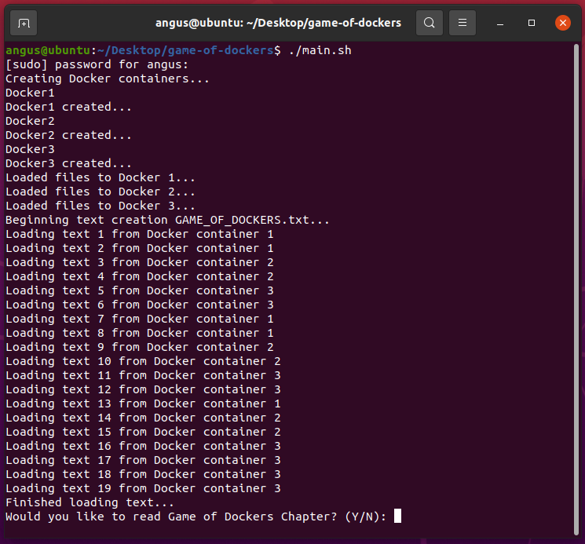
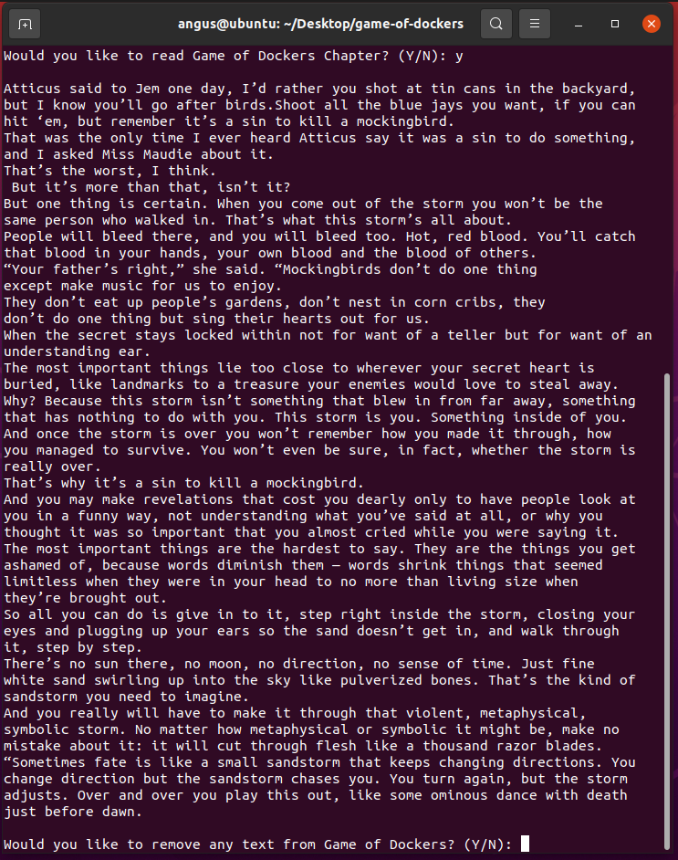
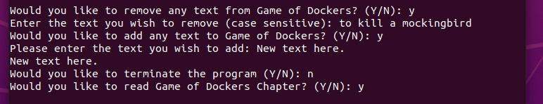
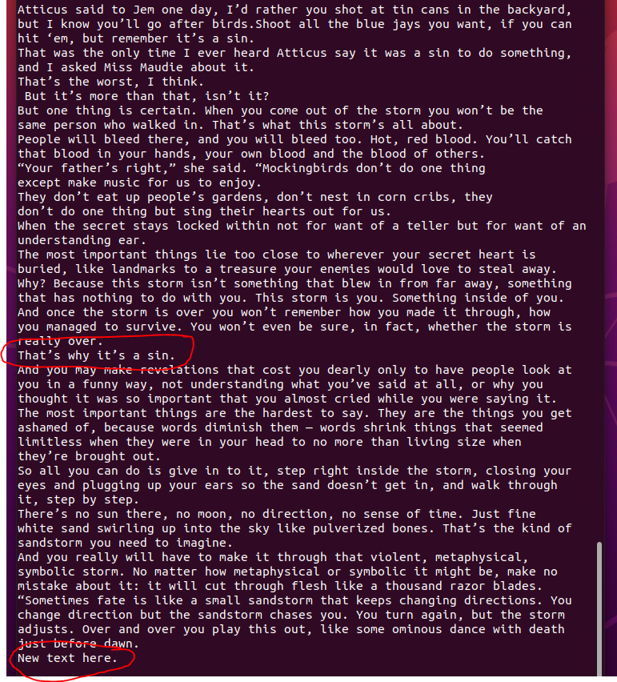
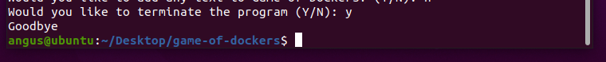

# Game of Dockers
 Bash program used to learn Docker basics and scheduling algorithms such as Round Robin, Shortest Job Next and First Come First Served in bash scripting within a UNIX environment.

Contents
- [Game of Dockers](#game-of-dockers)
  - [Requirements](#requirements)
  - [Running the script](#running-the-script)
  - [Directories](#directories)
  - [Sorting Scripts](#sorting-scripts)
  - [Screenshots](#screenshots)

## Requirements
- The scripts are designed to be used in a UNIX environment only
- Docker must be installed on system
  
## Running the script
The main entry point of the program is main.sh located in the project root directory. While in the root directory, the program can be started using ``./main.sh`` in terminal. After unzipping the program and opening a terminal window in the root directory, it is recommended to first run ``chmod +x main.sh`` to give the main script the correct permissions it needs to execute.

> ``$ chmod +x main.sh``

> ``$ ./main.sh``

## Directories

**/src**
- The Docker source text files must be placed in this directory. 
- The program also assumes they will be categorised in further sub directories as Docker1, Docker2 or Docker3
  
**/output**
- Where the final GAME_OF_DOCKERS.txt file will be sent to. 
- Please note on every new execution of the program, the old file will be removed to make room for the new one.
  
**/scripts**
- Holds all scripts the program needs to run apart from ``main.sh``

**/temp**
- Used as a temporary storage location. 
- During the building of the final text file, the files are first sorted in their respective Docker container before being sent to /temp on the host. 
- Docker1 becomes d1.txt and so on. The program then uses these files during the Round Robin execution.

## Sorting Scripts
In the scripts directory you will find ``sort_files_FCFS.sh`` and ``sort_files_SJN.sh``. These scripts are sent to the Docker container to sort the files. FCFS is for Docker 1 to sort using First Come First Serve. SJN is used in Dockers 2 and 3 to use Shortest Job Next.

## Screenshots

Running `./main.sh` creates the docker containers, loads the text into the containers then begins sorting them using scheduling algorithms.

Here you can remove text and add new text to the end of the chapter.

"to kill a mockingbird" has been removed and "New text here." added to the end of the file.

To terminate the program enter "Y" when prompted.
